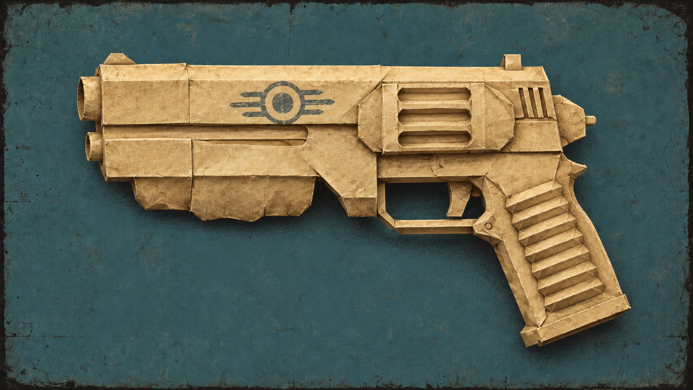

# PAPER



**Propper Active Precision Engineered Reloads** · Part of the RPS Suite for Fallout 4 VR.

[Download on Nexus Mods](https://www.nexusmods.com/fallout4/mods/108883) · [ROCK](https://www.nexusmods.com/fallout4/mods/108881) · [RPS SDK](https://github.com/brunocatani/RPS_SDK)

PAPER restores visible reload and weapon-cycling animations in Fallout 4 VR. Working with ROCK, it makes your arms, hands, and fingers follow the equipped weapon's animation while the default mode keeps the weapon following your controller.

## Features

- **Animated reloads:** bring the player's hands back into the weapon's reload sequence.
- **Weapon cycling:** animate supported bolt actions, lever actions, and revolver hammer cocking.
- **Controller-directed handling:** keep control of the weapon while the hands animate around it.
- **Optional manual reloads:** disable automatic reload requests when ammunition runs out.
- **Live settings:** edit configuration without restarting, including through RobCo PALM.

## Requirements

- Fallout 4 VR.
- [F4SEVR](https://f4se.silverlock.org/).
- [ROCK](https://www.nexusmods.com/fallout4/mods/108881) and its requirements.
- [FRIK v78.2 or newer](https://www.nexusmods.com/fallout4/mods/53464).
- [VR Address Library for F4SEVR](https://www.nexusmods.com/fallout4/mods/64879).

## Installation

1. Install the requirements and download PAPER from its [Nexus page](https://www.nexusmods.com/fallout4/mods/108883).
2. Install the archive through your mod manager. The plugin must resolve to `Data/F4SE/Plugins/PAPER.dll`.
3. Enable the mod and launch Fallout 4 VR through F4SEVR.

PAPER creates its configuration on first use. The GitHub source archive is for development; use the Nexus download for installation.

## Animation compatibility

Custom animation replacers for vanilla weapons are recommended. Results depend on the equipped weapon's animation assets and their VR compatibility; some animations may already be broken in VR.

**Virtual Reloads is currently incompatible**, as listed on the [PAPER Nexus page](https://www.nexusmods.com/fallout4/mods/108883). [PAPER Toolkit](https://github.com/brunocatani/PAPER_Toolkit) is a separate personal experimental development tool and is not recommended for normal use.

## Configuration

The active file is under your Windows Documents folder:

```text
My Games/Fallout4VR/Mods_Config/PAPER/PAPER.ini
```

PAPER creates a missing file from compiled defaults and preserves an existing file. Missing settings use their compiled defaults without adding entries to that file. Settings hot reload automatically and can also be edited through RobCo PALM.

| Setting | Default | Purpose |
| --- | --- | --- |
| `[Main] bEnabled` | `true` | Enable reload coordination and the manual-reload-only option. |
| `[Main] iLogLevel` | `2` | Normal information-level logging. |
| `[Reload] bManualReloadOnly` | `false` | Set to `true` to block automatic reload requests after ammunition runs out. Manual reload input remains available. |
| `[Debug] bDebugDrawNativeAnimation` | `false` | Draw diagnostic animation targets for development. |

The complete [configuration example](data/config/PAPER_example.ini) documents all supported settings. It is a human reference: PAPER never reads, embeds, copies, or deploys it. Builds deploy only the DLL and PDB.

Development capture and motion caching are off by default. The `DevelopmentCapture` settings limit what developer tools and API consumers may activate. Persistent cache size limits take effect at the next game session.

The plugin log is at `Documents/My Games/Fallout4VR/F4SE/PAPER.log`. When reporting an animation problem, include the weapon, installed animation replacer, action that failed, and the log from that game session.

## For developers

PAPER consumes ROCK's animation phases and exposes reload stages, animation observations, and weapon motion through its public API. The [RPS SDK](https://github.com/brunocatani/RPS_SDK) contains integration documentation and examples; this repository also includes the [PAPER API header](SDK/PAPER/include/PAPERApi.h).

<details>
<summary>Building from source</summary>

Requires Windows x64, Visual Studio 2022 with the v143 C++ toolset and Windows SDK, CMake 4.2 or newer, PowerShell 7 (`pwsh`), vcpkg, and CommonLibF4VR. The project uses C++23 and links CommonLibF4VR directly.

Copy [CMakeUserPresets.json.template](CMakeUserPresets.json.template) to `CMakeUserPresets.json`. Replace the example vcpkg and CommonLibF4VR paths and set `COPY_PLUGIN_BASE_PATH` to your PAPER mod folder. The `custom-fast` preset automatically copies `PAPER.dll` and `PAPER.pdb` into that folder's `F4SE/Plugins` directory.

Run from the repository root:

```powershell
cmake --preset custom-fast -B build-fast
cmake --build build-fast --config Release --target PAPER -- /m:1 /p:CL_MPCount=2
```

Build and run the existing tests separately:

```powershell
cmake --preset custom-tests -B build-tests
cmake --build build-tests --config Release --target PAPERPolicyTests PAPERObservationApiTests PAPERConfigFileTests PAPERWeaponMotionCacheTests -- /m:1 /p:CL_MPCount=2
ctest --test-dir build-tests -C Release --output-on-failure -j 4
```

</details>

## Source and license

[Source code](https://github.com/brunocatani/PAPER) · [GNU GPL v3 only (GPL-3.0-only)](LICENSE).

Built with the assistance of AI.
